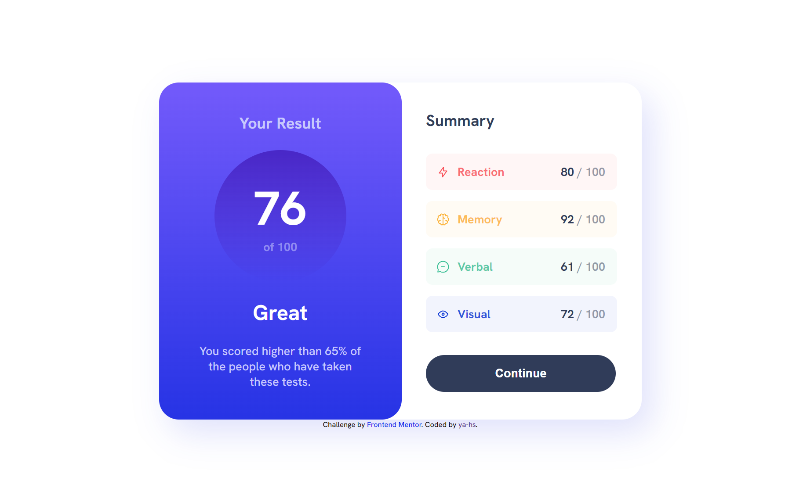

# Frontend Mentor - Results summary component solution

This is a solution to the [Results summary component challenge on Frontend Mentor](https://www.frontendmentor.io/challenges/results-summary-component-CE_K6s0maV). Frontend Mentor challenges help you improve your coding skills by building realistic projects. 

## Table of contents

- [Overview](#overview)
  - [The challenge](#the-challenge)
  - [Screenshot](#screenshot)
  - [Links](#links)
- [My process](#my-process)
  - [Built with](#built-with)
  - [What I learned](#what-i-learned)
  - [Continued development](#continued-development)
- [Author](#author)

## Overview

### The challenge

Users should be able to:

- View the optimal layout for the interface depending on their device's screen size
- See hover and focus states for all interactive elements on the page
- **Bonus**: Use the local JSON data to dynamically populate the content

### Screenshot

### Links

- Solution URL: [Add solution URL here](https://your-solution-url.com)
- Live Site URL: [ya-hs](https://ya-hs.github.io/Results-Summary-Component/)

## My process

### Built with

- Semantic HTML5 markup
- CSS custom properties
- Flexbox
- Figma

### What I learned

I used this challenge as an opportunity to begin my journey in learning to use Figma. Rather than subscribing to Pro to unlock the figma files, I recreated the component from scratch to the best of my abilities. Once I was happy with how it looked in figma, I used the developer mode to pull across measurements.

I learned that working in this way, whilst useful for comparison, is not perfect. Hard-coded pixel sizes for widths and heights can cause making the site responsive to be quite difficult. As such, I only coded the responsiveness to work for the suggested 375x809px mobile display without any other mobile resolutions in mind.

In future I would like to look at using ems, rems, and percentages along with figma to try and keep it as responsive as possible.

### Continued development

As mentioned, I will use this opportunity to continue learning how Figma works and how to go back to percentages for responsiveness.

## Author

- Website - [ya-hs](https://github.com/ya-hs)
- Frontend Mentor - [@ya-hs](https://www.frontendmentor.io/profile/ya-hs)